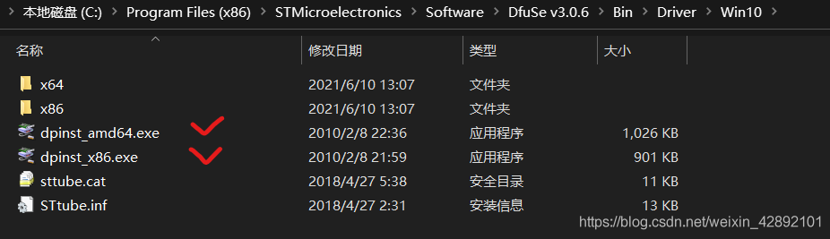
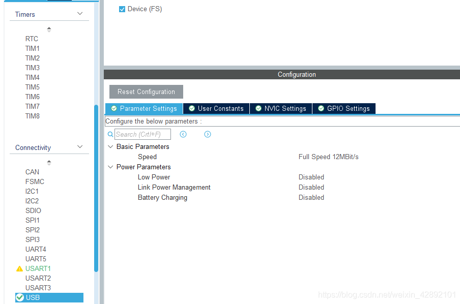
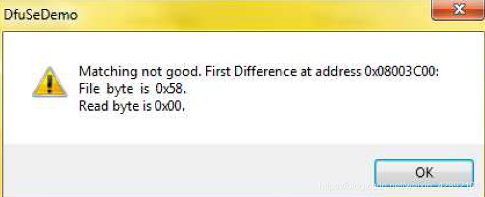
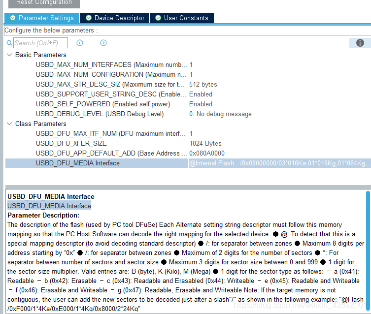
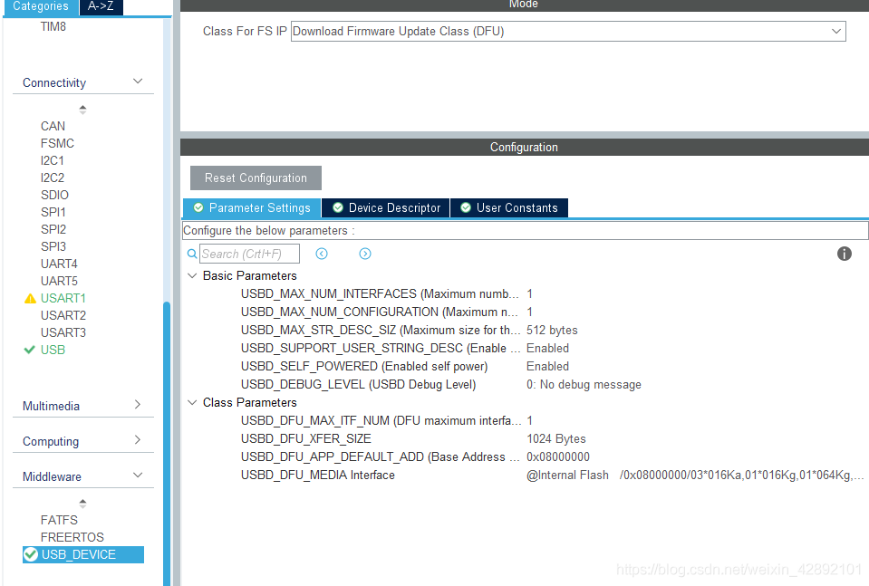
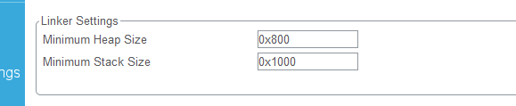
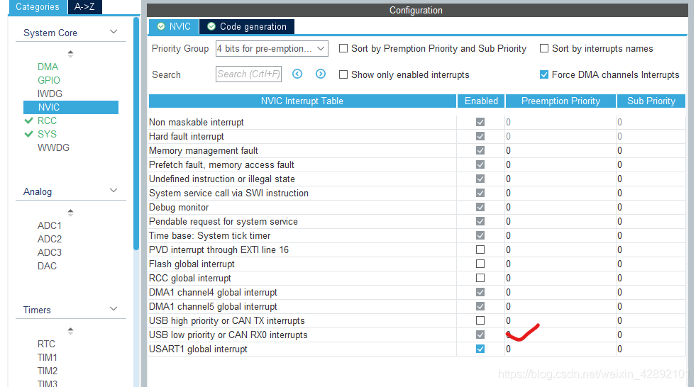
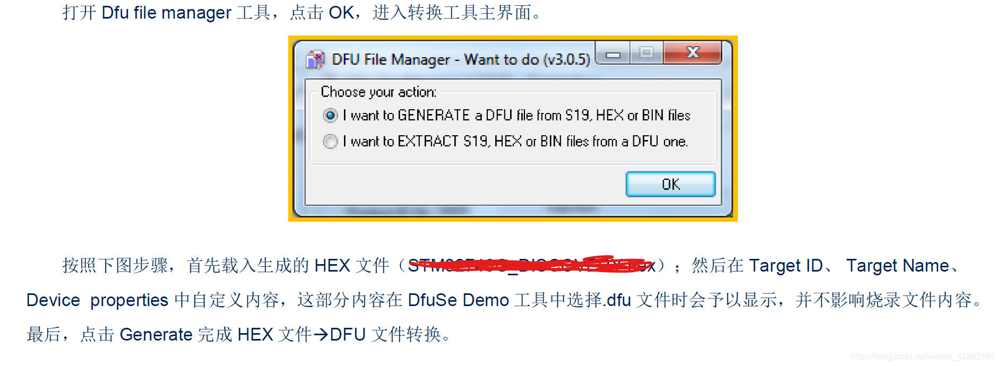
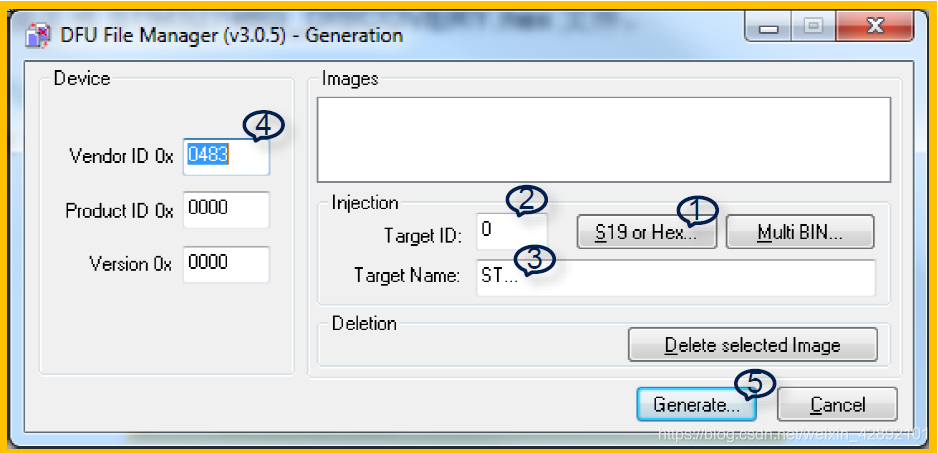
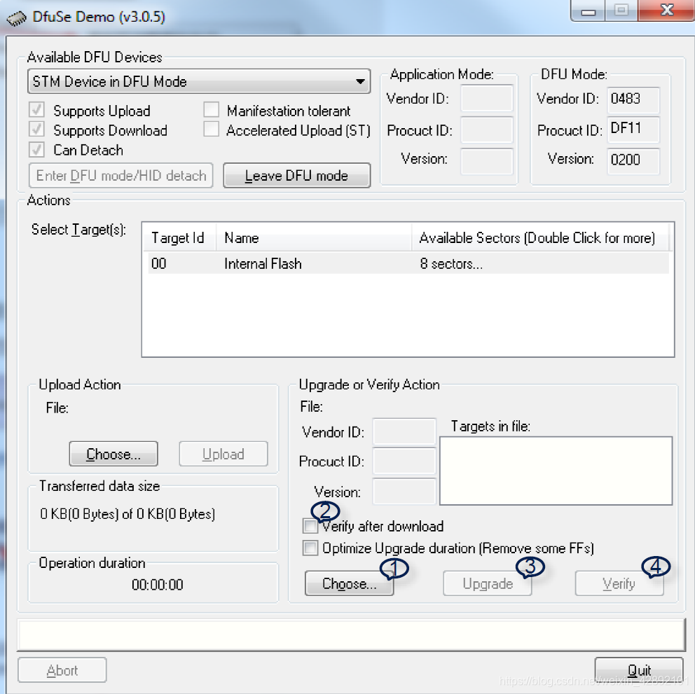

@[toc](STM32 USB DFU功能)
DFU的全称为：DownLoad Firmware Update即固件升级
以下配置以STM32F103ZET6为例。
# 工具的安装配置
DfuSe v3.0.5 直接到ST官网下载，下载完成后找到目录下的驱动并安装


# CubeMX上配置
开启USB外设

配置中间件，USB协议栈
这里配置==使用默认即可，暂时先不改，原始配置烧录进设备后，USB应枚举成功==，请求描述符失败情况应注意堆栈调整

**在枚举成功的情况下，此处配置的修改：**

>USBD_DFU_MEDIA Interface描述的含义：0x08000000 为起始地址。“a”代表的是Read-only，“g”代表Read/Write/Erase。也就是说，“a”所指明的区域应该为
>Bootloader 的空间不可擦除或者修改，“g”所指明的区别为用户代码空间。大小由前面的数字决定，乘号“*”前面的为Sector 的个数，后面
>的为Sector 的大小，这里的意思就是从0x08000000 开始，前面3 个Sector（每个Sector 为16k 字节）为Read-only，后
>面1 个Sector（每个Sector 为16k 字节）为Read/Write/Erase，等等。

示例
>"@Internal Flash /0x08000000/120\*128Ba,1416*128Bg" 
>含义：
>从0x08000000 开始，前面120 个Sector（每个Sector 为128 字节）为Read-only，后
>面1416 个Sector（每个Sector 为128 字节）为Read/Write/Erase。

注意点
>当设置为Read-only属性的Sector，不可烧写！否则会报如下错误：


它如何知道你烧写的地址与只读属性区域产生冲突的？
>因为你生成的hex文件已经定义了程序的起始地址，或者你生成的Bin文件转为DFU文件时设置的

当然我所说的这些，在CubeMX工具里都有的说明

USBD_DFU_APP_DEFAULT_ADD设置
>此处设置的值应为你升级下载存放的起始地址，对于字段中APP字眼切勿认为需要填写APP程序的起始地址，其实它的作用就是触发DFU传输升级时告诉你应该擦除哪片区域地址，因为大多数DFU功能都在应用在Bootloader工程中，相对于Bootloader，在运行DFU升级，应该简单直接（直接擦除或写入APP区域地址的数据，而不是在APP中运行DFU升级，不能直接擦除APP自身代码，而是中转一下，下载到下载区或者其他不干涉APP程序代码的区域）

下图是未做调整，只为验证枚举成功的CubeMX初始配置


堆栈设置，因为DFU默认使用了1K的缓冲区（`USBD_static_malloc`），所以栈区的大小一定大于2K才能不会出现问题，这里大小设置可以编译后查看map文件，查看栈的使用情况。

确认中断使能

# 完善接口
在CubeMX配置完成后，完善以下接口，位于`usbd_dfu_if.c`
```c
MEM_If_Erase_FS,//擦除相关区域
MEM_If_Write_FS,//写入新固件到相关区域
MEM_If_Read_FS,//读取相关区域，返回写入完成后的数据
```
参考如下：
```c
/**
  * @brief  Erase sector.
  * @param  Add: Address of sector to be erased.
  * @retval 0 if operation is successful, MAL_FAIL else.
  */
uint16_t MEM_If_Erase_FS(uint32_t Add)
{
  /* USER CODE BEGIN 2 */
  Update_Port_Write_New_Frimware_Info("app v2.0", Flash_Port_Get_Partition_Size("download"), "download");
  if(Flash_Port_Erase_Partition("download", true) == false)
  {
    return (USBD_FAIL);
  }
  
  /*预先写入下载成功标识*/
  Update_Port_Write_Download_Complete_Flag();
  
  Write_Data_Index = 0;
  Read_Data_Index = 0;
  return (USBD_OK);
  /* USER CODE END 2 */
}

/**
  * @brief  Memory write routine.
  * @param  src: Pointer to the source buffer. Address to be written to.
  * @param  dest: Pointer to the destination buffer.
  * @param  Len: Number of data to be written (in bytes).
  * @retval USBD_OK if operation is successful, MAL_FAIL else.
  */
uint16_t MEM_If_Write_FS(uint8_t *src, uint8_t *dest, uint32_t Len)
{
  /* USER CODE BEGIN 3 */
  if(Flash_Port_Write_Partition_Data("download", src, Write_Data_Index, Len, true) == -1)
  {
    return (USBD_FAIL);
  }
  Write_Data_Index += Len;
  return (USBD_OK);
  /* USER CODE END 3 */
}

/**
  * @brief  Memory read routine.
  * @param  src: Pointer to the source buffer. Address to be written to.
  * @param  dest: Pointer to the destination buffer.
  * @param  Len: Number of data to be read (in bytes).
  * @retval Pointer to the physical address where data should be read.
  */
uint8_t *MEM_If_Read_FS(uint8_t *src, uint8_t *dest, uint32_t Len)
{
  /* Return a valid address to avoid HardFault */
  /* USER CODE BEGIN 4 */
  if(Flash_Port_Read_Partition_Data("download", dest, Read_Data_Index, Len) == -1)
  {
    return dest;
  }
  Read_Data_Index += Len;
  return dest;
  /* USER CODE END 4 */
}
```
APP固件中，中断向量表的调整，放置在main.c中起始处，此处的设置必须和你的Flash设置的起始地址一致
```c
/**
  ******************************************************************
  * @brief   中断向量表迁移
  * @param   [in]None
  * @return  None.
  * @author  aron566
  * @version V1.0
  * @date    2021-02-25
  ******************************************************************
  */
void User_InterruptVectorTable_Move(void)
{
  SCB->VTOR = (0x8000000+(128*1024));
}
```

烧写完成后，新App应用即程序跳转执行，代码放置的位置，应当在固件下载完成之后，执行。
```c
typedef void (*pFunction)(void);
/* Test if user code is programmed starting from USBD_DFU_APP_DEFAULT_ADD address */ 
if(((*(__IO uint32_t*)USBD_DFU_APP_DEFAULT_ADD) & 0x2FFE0000 ) == 0x20000000) 
{ 
	/* Jump to user application */ 
	JumpAddress = *(__IO uint32_t*) (USBD_DFU_APP_DEFAULT_ADD + 4); 
	JumpToApplication = (pFunction) JumpAddress; 
	/* Initialize user application's Stack Pointer */ 
	__set_MSP(*(__IO uint32_t*) USBD_DFU_APP_DEFAULT_ADD); 
	JumpToApplication(); 
}

```
[Bootloader参考这里](https://blog.csdn.net/weixin_42892101/article/details/113923735)

# 工具使用
## HEX固件转为DFU文件


## 更新固件
打开DfuSeDemo，结合下图步骤，点击’Choose’加载之前转换的.dfu文件；选择配置；点击’Update’完成擦除与下载；另外，可以通过点击’Verify’验证是否下载成功



# DFU好与坏
好处：由于DFU是USB差分传输，相对而言速率和通讯稳定性上相当于UART更加快与稳定
不好的地方：设备端不知道待接收文件的大小，何时传输结束，只为传输而传输，相比较带有完整文件传输协议而言（Ymodem、Xmodem等）这个差太多，不过CDC可以替代解决这个问题